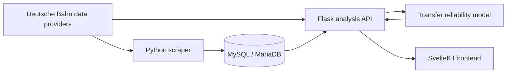

# OnPoint.

**A journey planner for German rail routes that looks beyond the scheduled travel time.**

OnPoint combines current timetable data with historical delays and cancellations. It estimates whether each transfer is likely to work, checks the next usable connection when it does not, and ranks route alternatives by their expected total travel cost.

[Live demo](https://bahn.juhermes.de) · [Frontend documentation](onpoint/my-app/README.md)


<!-- Screenshot placeholder

Add a wide screenshot of the route comparison here, for example:


Recommended: 1600 × 900 px, showing multiple alternatives and one expanded transfer analysis.
-->

## Why OnPoint?

The connection with the shortest scheduled duration is not always the best one. A tight transfer can save a few minutes on paper but cause a much larger delay when it is missed.

OnPoint makes that trade-off visible. For every route alternative it considers:

- scheduled journey duration;
- historical arrival and departure delays;
- known train cancellations;
- the probability of completing each transfer;
- the additional delay caused by the next usable Plan B;
- a configurable comfort penalty for every transfer.

The result is a recommendation based on expected travel cost rather than scheduled duration alone.

## How it works

1. The scraper collects repeated arrival and departure observations for 32 selected stations and stores the latest reliable state of every train event in MySQL.
2. The backend requests current journey alternatives from Deutsche Bahn routing providers.
3. For each transfer, the statistical model compares historical arrival and departure delay distributions and includes observed cancellations.
4. OnPoint searches for the next usable connection after a potentially missed transfer.
5. The alternatives are ranked using:

   ```text
   expected total cost
     = scheduled duration
     + transfer comfort penalties
     + Σ(miss probability × Plan-B delay)
   ```

The displayed probabilities are estimates based on the available historical sample. They are useful for comparing routes, but they are not guarantees for an individual journey.

## Architecture



The scraper and API are designed to run independently. The included systemd examples deploy both services on a Raspberry Pi, while Gunicorn serves the Flask application behind a reverse proxy.

## Features

- comparison of up to six complete route alternatives;
- empirical transfer probabilities with Bayesian smoothing for small samples;
- cancellation-aware historical analysis;
- exact Plan-B lookup for every transfer;
- bounded parallel Plan-B requests with per-analysis caching;
- German and English user interface;
- regional-train-only routing option;
- compact, idempotent historical event storage;
- scraper health records and configurable retention;
- responsive SvelteKit interface.

## Technology

- **Frontend:** SvelteKit, TypeScript, Tailwind CSS, DaisyUI
- **Backend:** Python, Flask, Gunicorn
- **Data:** MySQL/MariaDB
- **Routing:** db-vendo-client, pyhafas and transport.rest fallback
- **Runtime:** Bun for the DB Web provider integration
- **Deployment:** Raspberry Pi and systemd

## Repository layout

```text
onpoint/
├── backend.py                 # Flask API and route scoring
├── connection_model.py        # Statistical transfer model
├── scrape_train_data.py       # Historical station-board scraper
├── migrate_train_db.py        # Idempotent database migration
├── compact_train_db.py        # Optional snapshot compaction
├── scrape_stations.txt        # Scraped station set
├── deploy/                    # Example systemd services
├── tests/                     # Python tests
└── my-app/                    # SvelteKit frontend
```

## Local development

### Requirements

- Python 3.11 or newer;
- Node.js and npm;
- MySQL or MariaDB;
- access to the configured routing provider.

### Installation

Create a virtual environment at the repository root and install the backend dependencies:

```bash
python -m venv .venv
source .venv/bin/activate
pip install -r onpoint/requirements.txt
```

On Windows PowerShell, activate it with:

```powershell
.venv\Scripts\Activate.ps1
```

Install the frontend dependencies:

```bash
cd onpoint/my-app
npm ci
```

The npm dependencies include a platform-specific Bun runtime. With `NODE_EXECUTABLE=auto` (the default), the backend and scraper detect the packaged executable on Windows as well as 64-bit Raspberry Pi systems. Set an explicit path only when an override is required.

Copy the example configuration and provide your local database credentials:

```bash
cd ..
cp .env.example .env
```

Never commit the resulting `.env` file.

### Run the application

Start the Flask API from `onpoint/`:

```bash
python backend.py
```

In another terminal, start the frontend from `onpoint/my-app/`:

```bash
npm run dev
```

Vite proxies `/api` requests to the Flask server on `http://localhost:5000`.

## Verification

Run the backend tests from `onpoint/`:

```bash
python -m unittest discover -s tests -v
```

Check and build the frontend from `onpoint/my-app/`:

```bash
npm run check
npm run build
```

## Historical event storage

Each arrival or departure is identified by:

```text
event type + internal station id + DB trip id + planned date/time
```

Repeated observations update the same logical event instead of appending duplicate snapshots. A `realtime_known` quality flag prevents a later plan-only response from overwriting a previously observed realtime delay or cancellation.

After updating an existing installation, run the idempotent migration once:

```bash
cd /home/pi/BahnProjekt/onpoint
../.venv/bin/python migrate_train_db.py
```

After creating a backup, old imported snapshots can optionally be compacted:

```bash
../.venv/bin/python compact_train_db.py
../.venv/bin/python compact_train_db.py --apply --optimize
```

The first command is a dry run. The apply command retains the newest row for every logical train event.

The database account used for the migration requires `ALTER`, `CREATE`, `INDEX`, `SELECT` and `UPDATE` privileges. The regular scraper can use a more restricted read/write account after the migration.

## Raspberry Pi deployment

A typical update sequence is:

```bash
cd /home/pi/BahnProjekt
git pull
.venv/bin/pip install -r onpoint/requirements.txt
cd onpoint/my-app
npm ci
npm run build
cd ..
../.venv/bin/python migrate_train_db.py
```

Test the board provider without writing data:

```bash
../.venv/bin/python scrape_train_data.py \
  --stations-file scrape_stations.txt \
  --dry-run
```

Start one continuous scraper process:

```bash
../.venv/bin/python scrape_train_data.py \
  --stations-file scrape_stations.txt \
  --interval 600
```

To check both the live and finalization windows immediately without writing data:

```bash
../.venv/bin/python scrape_train_data.py \
  --stations-file scrape_stations.txt \
  --finalize-now \
  --dry-run
```

The default configuration uses one persistent Bun process, automatic rate-limit retries, a recurring live window and a separate finalization window for departed trains. Scrape health is recorded once per station request and old health records are removed according to the configured retention period. All values can be adjusted in `.env`; the available settings are documented in [`.env.example`](onpoint/.env.example).

Example services are available in [`onpoint/deploy`](onpoint/deploy). Adjust the user and paths before copying them to `/etc/systemd/system/`.

```bash
sudo systemctl daemon-reload
sudo systemctl enable --now onpoint-backend onpoint-scraper
```

## Data sources and limitations

OnPoint uses imported historical railway data and current routing information from Deutsche Bahn-compatible providers. Coverage and confidence depend on the stations, trains and time periods available in the local database. Live operational information and ticketing should always be confirmed with the relevant transport provider.

This is an independent personal project and is not affiliated with Deutsche Bahn AG.
